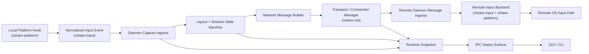
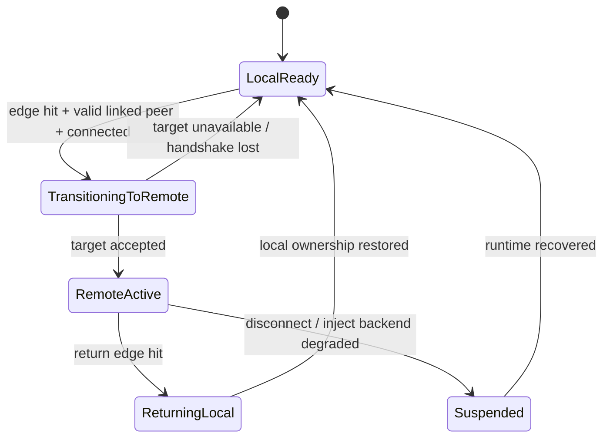

# Alpha-2 Full Input Loop Design

## Summary

**Goal:** define the production shape of the Alpha-2 input loop so `R-ShareMouse` can move from a control-plane prototype into a real Windows-to-Windows daily validation candidate.

Alpha-2 is the first milestone where the product must prove a real end-to-end path:

`local capture -> routing/session decision -> network transport -> remote injection -> visible runtime state -> disconnect/reconnect recovery`

The design in this document deliberately treats the daemon as the canonical runtime owner. The GUI and CLI remain operators of that runtime, not alternate sources of truth. Platform crates provide capture/inject primitives; network crates provide discovery and transport; the daemon owns topology, session state, routing, health aggregation, and fail-safe behavior.

## Goals

- Deliver a real unlocked-desktop Windows-to-Windows input-sharing loop.
- Replace ad hoc input forwarding with a layout-driven routing and session model.
- Make backend health, selected mode, and runtime capability truthful across daemon, CLI, and GUI.
- Define a stable runtime model that later phases can extend to clipboard, pairing, helper processes, and multi-platform support.
- Ensure Alpha-2 validation can be expressed as deterministic unit, integration, and manual dual-machine tests.

## Non-Goals

- No login screen, UAC, secure desktop, or privileged helper support in Alpha-2.
- No certificate pairing or enterprise trust flow yet.
- No file transfer or advanced clipboard semantics.
- No virtual HID dependency for Alpha-2 acceptance.
- No attempt to make GUI layout editing fully feature-complete; only the minimum topology control required to drive the daemon.
- No promise of macOS parity in Alpha-2, though interfaces must not block later macOS work.

## Alpha-2 Success Criteria

Alpha-2 is complete when all of the following are true:

- Windows-native capture and inject backends are operational on the normal unlocked desktop.
- A user can discover a peer, connect, hit a configured screen edge, and control the remote machine.
- The routing target is derived from topology, not from "first connected device".
- Disconnect, reconnect, and daemon restart do not leave the runtime in a false healthy state.
- The daemon, CLI, and GUI report the same backend mode, health, connected peer count, and current control target.
- Two-machine validation proves mouse move, button, wheel, and keyboard flow across repeated runs.

## End-To-End Data Flow



### Narrative

1. The local platform layer captures raw OS events.
2. `rshare-input` normalizes those events into a cross-platform `InputEvent`.
3. The daemon receives the event and asks the routing/session model whether the event should:
   - remain local,
   - transition into remote control,
   - remain in remote control,
   - or release back to local.
4. If the event is forwarded, the daemon converts it into the network protocol form and sends it over the active peer session.
5. The remote daemon receives the message, converts it back into an injectable input event, and invokes the selected inject backend.
6. The daemon continuously publishes runtime state so the GUI and CLI can show real capability instead of inferred optimism.

## Architecture

### Control Plane

The control plane includes:

- daemon IPC commands and snapshots
- peer directory and connection state
- topology configuration
- backend selection and health reporting
- operator actions from GUI/CLI

The control plane must be stable even when no input session is active.

### Data Plane

The data plane includes:

- platform capture callbacks
- normalized input events
- routing/session decisions
- network transport of input messages
- remote injection

The data plane must stay minimal and latency-sensitive. It must not depend on GUI state, and it must degrade to "local only" if any required runtime dependency becomes invalid.

### Platform Plane

The platform plane includes:

- Windows low-level hooks
- `SendInput` injection
- screen enumeration
- privilege state reporting relevant to the unlocked desktop path

The platform plane does not own topology or peer selection.

## Component Responsibilities

### `crates/rshare-platform`

Owns:

- Win32 low-level hook integration
- `SendInput` ABI-safe injection
- screen geometry enumeration
- injected-event filtering to prevent loopback

Does not own:

- peer discovery
- topology decisions
- session state
- daemon runtime truth

### `crates/rshare-input`

Owns:

- normalized `InputEvent` model
- capture/inject backend interfaces
- backend selection policy
- backend health and privilege representation

Does not own:

- which peer should receive an event
- persistent layout config
- network message transport

### `crates/rshare-net`

Owns:

- discovery
- connect/disconnect lifecycle
- handshake and message transport
- connection-level event fanout

Does not own:

- edge routing policy
- input backend selection
- GUI-facing runtime snapshot assembly

### `apps/rshare-daemon`

Owns:

- canonical runtime state
- topology model and routing decisions
- session transitions
- connection/error recovery behavior
- IPC snapshots and operator commands
- aggregation of platform/input/network truth into one runtime model

The daemon is the only place where "who is controlling whom right now" is authoritative.

### GUI / CLI

Own:

- operator visibility
- commands to start, stop, connect, disconnect, and edit layout
- display of backend and session truth

Do not own:

- any hidden routing state
- a private layout schema
- their own derived definition of service health

## Canonical State Models

The following models should become stable daemon-facing contracts for Alpha-2.

### `PeerDirectoryEntry`

```rust
struct PeerDirectoryEntry {
    id: DeviceId,
    name: String,
    hostname: String,
    addresses: Vec<String>,
    discovery_state: DiscoveryState,
    connection_state: ConnectionState,
    last_seen_at: Instant,
    last_error: Option<String>,
}
```

Purpose:

- unify discovered and connected device state
- remove the split between "discovered list" and "runtime target guess"

### `BackendRuntimeState`

```rust
struct BackendRuntimeState {
    selected_mode: Option<ResolvedInputMode>,
    available_backends: Vec<BackendKind>,
    capture_health: BackendHealth,
    inject_health: BackendHealth,
    aggregate_health: BackendHealth,
    privilege_state: PrivilegeState,
    last_error: Option<String>,
}
```

Purpose:

- separate capture truth from inject truth
- allow the daemon to report "service up but input degraded"

### `LayoutGraph`

```rust
struct LayoutGraph {
    version: u32,
    local_device: DeviceId,
    nodes: Vec<LayoutNode>,
    links: Vec<LayoutLink>,
}

struct LayoutNode {
    device_id: DeviceId,
    displays: Vec<DisplayNode>,
}

struct DisplayNode {
    display_id: String,
    x: i32,
    y: i32,
    width: u32,
    height: u32,
    primary: bool,
}

struct LayoutLink {
    from_device: DeviceId,
    from_edge: Direction,
    to_device: DeviceId,
    to_edge: Direction,
}
```

Purpose:

- make edge routing explicit
- stop encoding topology as "who is connected first"

### `ControlSessionState`

```rust
enum ControlSessionState {
    LocalReady,
    TransitioningToRemote { target: DeviceId, edge: Direction },
    RemoteActive { target: DeviceId, entered_via: Direction },
    ReturningLocal { from: DeviceId },
    Suspended { reason: SuspendReason },
}
```

Purpose:

- make the routing state machine debuggable and testable
- provide a stable status source for GUI and CLI

## Session / Routing State Machine

### States

- `LocalReady`
  - local input is captured but not forwarded
  - no active remote target
- `TransitioningToRemote`
  - an edge hit has selected a peer
  - runtime is validating connectivity and committing control handoff
- `RemoteActive`
  - keyboard and mouse events are forwarded to one remote peer
  - the active target is explicit
- `ReturningLocal`
  - runtime is clearing remote target and restoring local control semantics
- `Suspended`
  - service is up, but forwarding is disabled because the runtime is degraded

### Transition Rules



### Routing Rules

- A forwarded target must always come from `LayoutGraph`, not from a peer sort order.
- No forwarding occurs unless the session is in `TransitioningToRemote` or `RemoteActive`.
- If the active target disconnects, the session immediately leaves remote mode and enters `LocalReady` or `Suspended`.
- Mouse movement alone may trigger edge transitions; keyboard and button events only follow an already-selected session.
- A valid local fallback must always exist. Alpha-2 never permits "input black hole" semantics as an acceptable steady state.

## Layout / Topology Model

Alpha-2 requires a real layout source, but not full product-grade editing richness.

### Minimum Alpha-2 Topology Capabilities

- local device always present
- at least one display per device
- directional adjacency for left / right / up / down
- persistence of device placement
- distinction between disconnected peer and absent topology node

### Constraints

- topology edits are operator actions, not automatic side effects of discovery
- disconnected devices may remain in layout but cannot become active targets
- display geometry from the platform is runtime input; layout placement is operator-configurable state

### Why This Matters

Without a layout graph:

- multi-device routing cannot be deterministic
- GUI screen placement is cosmetic only
- the runtime cannot explain why a target was chosen
- testing cannot meaningfully cover edge behavior

## Backend Selection / Health Model

Backend selection must become a runtime truth model, not a constructor optimism model.

### Selection Policy

For Alpha-2 on Windows:

1. prefer `WindowsNative` if capture and inject are both healthy
2. fall back to `Portable` only if it is actually operational
3. never advertise `VirtualHid` as available unless it is constructed and healthy

### Health Rules

- `Healthy`
  - capture and inject are both usable
- `Degraded`
  - service can run, but the preferred backend is unavailable or one half is impaired
- `Unavailable`
  - no end-to-end input path exists

### Reporting Rules

- `selected_mode = None` means no working input path
- `available_backends` must only list real candidates
- the daemon snapshot must expose:
  - selected backend
  - capture health
  - inject health
  - aggregate health
  - privilege state

## Platform Integration

### Windows

Windows is the Alpha-2 primary platform.

Required:

- low-level hook capture
- `SendInput` injection using ABI-correct native structs
- injected-event filtering
- primary screen geometry

Allowed limitation:

- unlocked desktop only

### macOS / Linux

In Alpha-2:

- interfaces must remain extensible for these platforms
- they are not required to satisfy the primary end-to-end acceptance path
- no Windows-specific assumptions should leak into shared types unless explicitly gated

## Network Semantics

### Required Message Semantics

Alpha-2 requires the network layer to support:

- peer discovery events
- explicit connect/disconnect
- handshake with remote identity
- input message forwarding
- connection-level message receive events
- connection error and disconnect fanout

### Required Guarantees

- a daemon can distinguish "peer discovered" from "peer connected"
- input messages are attributed to the sending device identity
- a failed write cannot be silently treated as success
- connection loss produces a runtime event that can unwind the active control session

### Channel Separation

Alpha-2 may keep a shared message enum, but behavior must already treat the following as distinct logical channels:

- input control
- status and health
- topology and session events

That separation is needed so later phases can evolve protocol shape without rewriting daemon logic.

## IPC / CLI / GUI Contract

Alpha-2 needs a stable daemon snapshot contract.

### Required Snapshot Surface

The status contract should cover at least:

- service pid and bind address
- backend runtime state
- peer directory entries
- current session state
- layout summary
- current active control target

### Required Actions

- start service
- stop service
- status snapshot
- connect peer
- disconnect peer
- get layout
- set layout

### UI Rules

- GUI and CLI read the same daemon snapshot model
- layout shown in the GUI must reflect the same routing data used by the daemon
- no UI should infer a control target independently

## Failure Handling / Recovery

Alpha-2 must define deterministic failure behavior even if the product surface stays minimal.

### Required Recovery Cases

- target disconnect while remote is active
- daemon restart while GUI is open
- input backend becomes degraded after service start
- discovery entry expires while layout node remains configured
- network write failure during active forwarding

### Recovery Principles

- prefer safe local fallback over stale remote forwarding
- never continue claiming `RemoteActive` after target disconnect
- stale discovery state must not erase operator-defined topology
- a backend failure changes runtime health immediately, not after a separate poll loop notices

## Security Boundaries For Alpha-2

Alpha-2 is intentionally narrow.

### Included

- LAN-oriented runtime
- explicit peer identity through handshake
- rejection of silently unavailable input paths

### Deferred

- pairing UI
- certificates
- signed helper processes
- secure desktop control
- privilege elevation beyond normal user session

The main boundary for Alpha-2 is honesty: the runtime must not report capabilities it cannot actually perform.

## Testing / Validation Matrix

### Unit Tests

- backend selection and health aggregation
- layout adjacency resolution
- session state transitions
- routing decisions for edge enter/return
- message-to-input conversion
- hook filtering of injected input

### Integration Tests

- discovery -> connect -> message receive
- connect -> remote input inject path
- disconnect during remote-active session
- daemon snapshot reflects connection and backend truth
- layout-driven target selection does not regress to first-connected behavior

### Manual Validation

- Windows machine A controlling Windows machine B
- left/right topology
- up/down topology
- disconnect while remote-active
- reconnect after daemon restart
- repeated service start/stop cycles

## Open Risks / Deferred Items

- current daemon implementation is still monolithic; Alpha-2 work should reduce logic density over time instead of expanding a single file indefinitely
- display enumeration and scaling are not yet mature enough for production multi-monitor correctness
- GUI layout editing remains partially product-shell-oriented and must be tied to the daemon schema incrementally
- helper/UAC/login behavior is deferred; Alpha-2 must not imply those scenarios are solved
- transport currently serves Alpha-2, but later protocol separation may require explicit typed channels

## Recommended Code Ownership For Alpha-2

- `crates/rshare-core`
  - runtime models, layout graph, session state machine
- `crates/rshare-input`
  - backend truth, normalization, inject/capture integration
- `crates/rshare-platform`
  - Windows capture/inject primitives and screen data
- `crates/rshare-net`
  - peer/session transport and connection events
- `apps/rshare-daemon`
  - canonical orchestration, routing, IPC, recovery
- `apps/rshare-desktop` and GUI/CLI
  - operator-facing projection of daemon truth

## Design Decision Summary

- The daemon is the canonical runtime owner.
- Layout drives routing; connection order never does.
- Backend truth must be explicit and observable.
- Alpha-2 is a real unlocked-desktop Windows path, not a helper/driver milestone.
- UI remains a consumer and operator of daemon state, not an alternate runtime.
