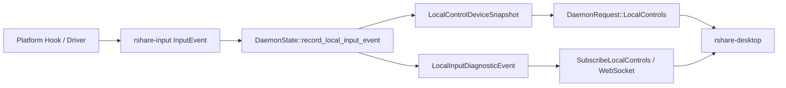
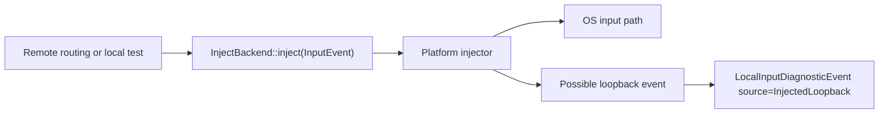
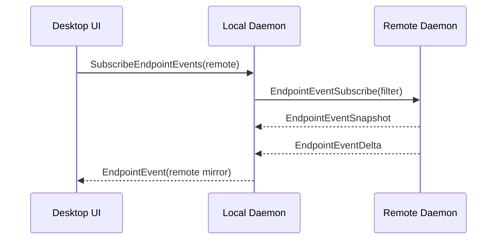

# 端侧事件获取与注入设计

## Summary

**Goal:** 为 `R-ShareMouse` 定义一套端侧事件获取与注入模型，让桌面端、CLI、daemon 和后续远端诊断都通过同一组事件语义工作，而不是各自拼装本机输入、远端状态和测试注入。

当前代码已经具备基础能力：

- `apps/rshare-daemon` 维护 `LocalControlDeviceSnapshot` 和 `LocalInputDiagnosticEvent`。
- `SubscribeLocalControls` 与 `ws://127.0.0.1:27436/local-controls` 可推送本机事件。
- `RunLocalInputTest` 可执行有限的键盘/鼠标注入测试。
- 输入后端已有 `CaptureBackend` / `InjectBackend` 抽象，Windows native、Virtual HID、Linux evdev/uinput 都在同一方向演进。

缺口是：事件没有明确区分“采集事件、注入请求、注入结果、远端镜像事件”；注入没有可通用调用的 IPC 契约；远端设备树只能显示发现目录，不能稳定订阅远端端侧事件。

本设计把端侧能力拆成两条对称链路：

- **Event Observation:** 端侧事件获取，用于 UI 监控、远端诊断、测试记录、回环抑制。
- **Event Injection:** 端侧事件注入，用于远端控制、真实注入测试、后续宏/辅助功能。

## Execution Status

截至 `2026-05-17`，P0.5 的代码落点已经完成到可自动化验证阶段：

- 已新增统一 `EndpointEvent`、过滤器、事件存储、注入请求和注入结果类型。
- 已扩展 daemon IPC：`EndpointEvents`、`SubscribeEndpointEvents`、`InjectEndpointEvent`。
- 已扩展 Tauri bridge：`endpoint_events_state`、`start_endpoint_events_stream`、`stop_endpoint_events_stream`、`inject_endpoint_event`。
- 已扩展网络协议：远端事件订阅、快照、增量、注入请求、注入结果。
- daemon 已能把本机诊断事件投影为端侧事件，并把远端事件镜像到本机事件流。
- daemon 已能执行本地 endpoint 注入，并通过 correlation id 记录注入回环事件。
- daemon 已能发送远端 endpoint 注入请求，并通过 pending correlation 等待远端注入结果。
- endpoint 注入执行路径已拆到 `apps/rshare-daemon/src/endpoint_runtime.rs`，避免继续膨胀 daemon 主入口。
- desktop 设备页已开始消费 endpoint 事件：本机/远端事件会转换成统一监控流，远端节点展开不再只依赖 UI 推导。
- desktop 的“真实注入测试”已切换到 `inject_endpoint_event`，本机和远端使用同一个注入结果模型。

仍未关闭的边界：

- 远端注入链路已具备协议、daemon runtime 和 desktop 调用入口，但仍需要双机实机验证真实平台注入。
- 当前注入 payload 只覆盖键盘、鼠标移动、鼠标按键和滚轮；手柄、音频、显示、USB 仍只作为观察事件进入模型。
- 订阅链路还没有做跨连接断点续传和严格速率限制；现阶段依赖快照 + 增量广播。

## Goals

- 统一本机和远端的事件表示，避免 UI 对每种来源写私有适配。
- 支持按设备、按类型、按来源订阅事件。
- 支持显式注入请求，并返回可诊断的注入结果。
- 将远端事件获取纳入 daemon 数据面，而不是只依赖 desktop 前端临时状态。
- 保留现有 `LocalControls` 快照和 WS 订阅，做兼容扩展，不破坏当前 UI。
- 明确回环抑制、权限失败、后端降级和速率限制语义。

## Non-Goals

- 不在这一阶段实现完整驱动级虚拟 HID。
- 不把 USB 原始报文转发纳入通用输入事件模型。
- 不把宏录制、脚本执行、快捷键配置做成产品功能。
- 不承诺登录界面、UAC、锁屏注入能力；这些仍属于 privileged helper / driver 阶段。
- 不让 desktop 直接控制平台输入后端；desktop 仍只通过 daemon IPC 调用。

## Terminology

- **Endpoint:** 端侧运行实例，通常是一个 daemon，拥有本机输入捕获、注入、显示、音频和设备枚举能力。
- **Observed Event:** 被平台 hook、驱动、音频/显示/手柄监听捕获到的事实事件。
- **Inject Request:** 调用方要求端侧执行的注入动作。
- **Inject Result:** 注入动作的完成状态，包括成功、失败原因、目标后端、耗时和可能的回环事件 ID。
- **Event Stream:** 快照之后的增量事件流，要求有单调递增序号和丢包可恢复语义。
- **Remote Mirror:** 本机 daemon 对远端 endpoint 事件流的本地镜像，用于 UI 展开远端设备树和诊断。

## Current State

### Existing Get Path



This is good enough for local UI monitoring, but weak for remote endpoint inspection because `LocalInputDiagnosticEvent` is currently local-first and the remote device identity is opportunistic.

### Existing Injection Path



This path is usable internally, but not exposed as a general daemon contract. `RunLocalInputTest` is test-specific and cannot express “inject this event to this endpoint and give me a result”.

## Proposed Architecture

### 1. Canonical Event Envelope

Add a new core type beside `LocalInputDiagnosticEvent`, not as a replacement:

```rust
pub struct EndpointEvent {
    pub event_id: EventId,
    pub sequence: u64,
    pub timestamp_ms: u64,
    pub endpoint_id: DeviceId,
    pub origin_endpoint_id: DeviceId,
    pub device: EndpointDeviceRef,
    pub direction: EndpointEventDirection,
    pub source: EndpointEventSource,
    pub kind: EndpointEventKind,
    pub payload: EndpointEventPayload,
    pub correlation_id: Option<EventCorrelationId>,
}
```

Key fields:

- `endpoint_id`: 哪台机器正在上报这条事件。
- `origin_endpoint_id`: 事件最初产生的机器。远端镜像转发时不变。
- `device`: 具体设备引用，允许只填 aggregate。
- `direction`: `Observed`, `Injected`, `InjectedLoopback`, `ForwardedIn`, `ForwardedOut`, `System`.
- `source`: `Hardware`, `UserModeHook`, `Driver`, `VirtualHid`, `SendInput`, `Audio`, `Display`, `RemoteMirror`, `Test`.
- `kind`: `Keyboard`, `Mouse`, `Gamepad`, `Display`, `Audio`, `Backend`, `Session`.
- `payload`: 强类型枚举，避免 UI 解析 summary 字符串。
- `correlation_id`: 把注入请求、注入结果和回环事件串起来。

`LocalInputDiagnosticEvent` 可由 `EndpointEvent` 投影生成，用于保持当前 desktop UI 兼容。

### 2. Endpoint Event Store

daemon 增加一个小型环形事件仓库：

```rust
pub struct EndpointEventStore {
    local_sequence: u64,
    recent: VecDeque<EndpointEvent>,
    recent_by_endpoint: HashMap<DeviceId, VecDeque<EventId>>,
    subscribers: broadcast::Sender<EndpointEvent>,
}
```

职责：

- 给本机事件分配单调序号。
- 保留最近 N 条事件，默认 512 或 2048，可配置。
- 支持按 `endpoint_id` / `kind` / `source` 过滤订阅。
- 当订阅者 lagged，客户端可通过 `after_sequence` 重新获取最近事件。
- 统一生成 `LocalInputDiagnosticEvent` 兼容事件。

不做：

- 不持久化完整事件历史。
- 不做复杂查询数据库。
- 不承担输入路由决策。

### 3. Event Observation IPC

保留现有接口：

- `LocalControls`
- `SubscribeLocalControls`
- `ws://127.0.0.1:27436/local-controls`

新增接口：

```rust
pub enum DaemonRequest {
    EndpointEvents {
        filter: EndpointEventFilter,
        after_sequence: Option<u64>,
        limit: Option<u16>,
    },
    SubscribeEndpointEvents {
        filter: EndpointEventFilter,
    },
}

pub enum DaemonResponse {
    EndpointEvents(Vec<EndpointEvent>),
    EndpointEvent(EndpointEvent),
}
```

Filter:

```rust
pub struct EndpointEventFilter {
    pub endpoint_id: Option<DeviceId>,
    pub device_id: Option<String>,
    pub kinds: Vec<EndpointEventKind>,
    pub sources: Vec<EndpointEventSource>,
    pub include_loopback: bool,
}
```

Desktop 使用策略：

- 设备页默认订阅 `EndpointEvents { endpoint_id = local }`。
- 展开远端设备时订阅 `endpoint_id = remote_device_id`。
- 如果远端未支持 endpoint events，则 fallback 到现有 remote diagnostic stream，并标记“远端事件流未接入”。

### 4. Event Injection IPC

新增通用注入请求：

```rust
pub enum DaemonRequest {
    InjectEndpointEvent {
        target: EndpointInjectTarget,
        request: EndpointInjectRequest,
    },
}

pub enum DaemonResponse {
    EndpointInjectResult(EndpointInjectResult),
}
```

Target:

```rust
pub enum EndpointInjectTarget {
    Local,
    Remote(DeviceId),
}
```

Request:

```rust
pub struct EndpointInjectRequest {
    pub correlation_id: EventCorrelationId,
    pub device_kind: EndpointEventKind,
    pub payload: EndpointEventPayload,
    pub mode: EndpointInjectMode,
    pub timeout_ms: u64,
}

pub enum EndpointInjectMode {
    BestEffort,
    RequireHealthyBackend,
    TestLoopback,
}
```

Result:

```rust
pub struct EndpointInjectResult {
    pub correlation_id: EventCorrelationId,
    pub target: EndpointInjectTarget,
    pub accepted: bool,
    pub backend_kind: Option<BackendKind>,
    pub health: BackendHealth,
    pub elapsed_ms: u64,
    pub loopback_event_id: Option<EventId>,
    pub error: Option<EndpointInjectError>,
}
```

错误分类：

- `BackendUnavailable`
- `BackendDegraded`
- `PermissionDenied`
- `UnsupportedEvent`
- `TargetDisconnected`
- `Timeout`
- `RejectedByPolicy`
- `TransportFailed`

### 5. Remote Event Mirroring

Remote endpoint events should travel over the existing peer transport, not over the desktop web UI.

Add protocol messages:

```rust
pub enum Message {
    EndpointEventSubscribe(EndpointEventFilter),
    EndpointEventSnapshot(Vec<EndpointEvent>),
    EndpointEventDelta(EndpointEvent),
    EndpointInjectRequest(EndpointInjectRequest),
    EndpointInjectResult(EndpointInjectResult),
}
```

Flow:



This makes the local daemon the only thing the UI needs to trust. The UI does not open ports to remote machines.

### 6. Loopback and Feedback Suppression

Every inject request gets a `correlation_id`. The daemon records a short loopback budget:

- keyboard: expected 1-2 events, default 750 ms
- mouse move: expected 1 event, default 250 ms
- mouse button: expected 1-2 events, default 750 ms
- wheel: expected 1 event, default 250 ms

If a captured event matches an active correlation window, mark:

```rust
direction = InjectedLoopback
source = InjectedLoopback
correlation_id = Some(...)
```

Do not forward loopback events back into the normal remote-control routing path.

### 7. Device Identity

Device identity must tolerate platforms that cannot attribute every event to a physical keyboard or mouse.

```rust
pub struct EndpointDeviceRef {
    pub device_id: String,
    pub instance_id: Option<String>,
    pub display_name: String,
    pub kind: EndpointEventKind,
    pub attribution: DeviceAttribution,
}

pub enum DeviceAttribution {
    Exact,
    Aggregate,
    Inferred,
    Unknown,
}
```

Rules:

- Low-level hook without device ID reports `Aggregate`.
- Raw Input / driver event with device path reports `Exact`.
- Event matched by recent active device reports `Inferred`.
- Remote fallback without details reports `Unknown`.

The UI should show exact devices when available and otherwise show aggregate nodes without pretending per-device attribution is exact.

## Component Responsibilities

### `crates/rshare-core`

- Define `EndpointEvent`, `EndpointEventPayload`, filters, inject request/result.
- Extend daemon IPC request/response enums.
- Add protocol message variants for remote mirroring and remote inject.
- Provide conversion between `EndpointEvent` and existing `LocalInputDiagnosticEvent`.

### `crates/rshare-input`

- Keep `InputEvent` as the low-latency data-plane event.
- Add conversion helpers:
  - `InputEvent -> EndpointEventPayload`
  - `EndpointInjectRequest -> InputEvent`
- Return structured `UnsupportedEvent` instead of broad string errors where possible.

### `apps/rshare-daemon`

- Own `EndpointEventStore`.
- Publish every captured, injected, forwarded, and system event through the store.
- Route `InjectEndpointEvent(Local)` to local `InjectBackend`.
- Route `InjectEndpointEvent(Remote)` over peer transport.
- Mirror remote endpoint events into local store with `source = RemoteMirror`.
- Keep `LocalControls` as a compatibility projection.

### `apps/rshare-desktop`

- Use `EndpointEvents` when available.
- Fall back to `LocalControls` until daemon and remote endpoint support are complete.
- Render local and remote devices from the same event/device model.
- Use `InjectEndpointEvent` for UI-driven real injection tests instead of special test-only commands.

## Delivery Plan

### P0.1: Core Types and Local Store

- Add endpoint event and inject types in `rshare-core`.
- Add event store in daemon.
- Convert existing `record_local_input_event` to publish endpoint events first, then derive legacy diagnostics.
- Keep current UI behavior unchanged.

Exit criteria:

- Existing tests pass.
- `LocalControls` output remains compatible.
- New unit tests verify sequence ordering, filtering, and legacy conversion.

### P0.2: Local Observation IPC

- Add `EndpointEvents` and `SubscribeEndpointEvents`.
- Add daemon client helpers.
- Add desktop bridge commands/events.

Exit criteria:

- UI can subscribe to local endpoint events without polling.
- Lagged subscriber can recover via `after_sequence`.

### P0.3: Local Injection IPC

- Add `InjectEndpointEvent(Local)`.
- Implement keyboard, mouse move/button/wheel.
- Emit `EndpointInjectResult`.
- Correlate loopback events with request ID.

Exit criteria:

- UI can run a real Shift and mouse move injection test through the generic contract.
- Injected loopback appears as correlated event, not as hardware input.

### P0.4: Remote Mirror

- Add protocol messages for endpoint event subscribe/snapshot/delta.
- Local daemon mirrors remote endpoint events into event store.
- Device tree remote expansion uses mirrored events when available.

Exit criteria:

- On two machines, expanding a remote node shows remote keyboard/mouse/display/audio activity if the peer supports the protocol.
- If peer does not support it, UI shows explicit fallback state.

### P0.5: Remote Injection

- Add `InjectEndpointEvent(Remote)`.
- Route request over peer transport and return remote result.
- Ensure target disconnect and backend degraded states are surfaced as typed errors.

Exit criteria:

- Desktop can request a remote endpoint injection test and receive a typed result.
- Normal ShareMouse control path can share the same result/error infrastructure.

## Test Plan

### Unit Tests

- Event store sequence ordering and retention.
- Filter by endpoint, device kind, source, loopback flag.
- `InputEvent` to `EndpointEventPayload` conversion.
- `EndpointInjectRequest` to `InputEvent` conversion.
- `EndpointEvent` to `LocalInputDiagnosticEvent` compatibility projection.
- Loopback correlation window behavior.

### Integration Tests

- IPC `EndpointEvents` returns snapshot after local injected test.
- `SubscribeEndpointEvents` sends initial snapshot and deltas.
- Inject local keyboard test returns result and correlated loopback.
- Remote mirror handles peer disconnect without poisoning local stream.

### Manual Dual-Machine Tests

- Start two daemons and two desktops.
- Confirm local device tree uses exact local events.
- Expand remote node and verify remote event stream appears.
- Run local injection test and verify local loopback classification.
- Run remote injection test and verify remote result.
- Disconnect remote and verify subscription transitions to `TargetDisconnected`.

## Risks

- **Per-device attribution is platform-dependent.** Windows Raw Input or driver paths can provide exact IDs; low-level hooks often cannot. UI must display attribution quality.
- **Remote event streaming can be noisy.** Apply rate limits and coalescing for mouse move and audio level events.
- **Injection can create feedback loops.** Correlation and suppression must be in daemon, not UI.
- **Protocol compatibility matters.** New message variants must gracefully degrade with older peers.
- **Security boundary must stay local-daemon owned.** Desktop must not directly inject through platform APIs.

## Acceptance Criteria

- `rshare-desktop` can view local endpoint events without polling-only behavior.
- Remote device tree expansion is backed by daemon-level remote event mirroring, not UI-only projection.
- UI-driven injection tests use a generic `InjectEndpointEvent` contract.
- Injection result includes backend, health, error classification, elapsed time, and correlation ID.
- Existing `LocalControls` UI continues to work during migration.
- Two-machine test proves event observation and injection for keyboard and mouse on Windows unlocked desktop.
