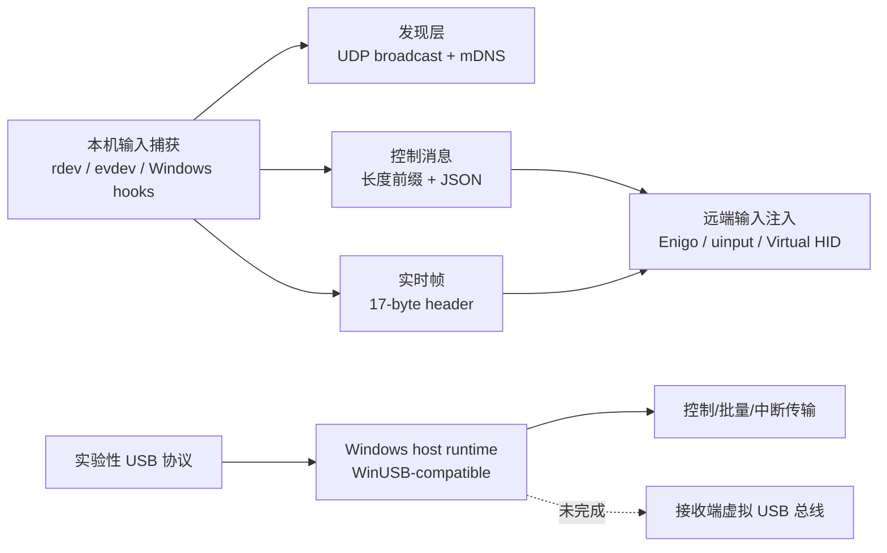

# USB Device Forwarding Feasibility Research Archive

Archived on: 2026-05-20

Source file: `C:/Users/10428/Downloads/deep-research-report.md`

Purpose: This document preserves the original research input used for R-ShareMouse architecture planning. It is a decision input, not a statement that every mentioned capability is already implemented in this repository.

Applicability: Use this report to reason about the boundary between low-latency input sharing, audio/gamepad/display endpoint capabilities, and experimental generic USB forwarding. The canonical project roadmap and implementation status remain in [../roadmap.md](../roadmap.md) and the design/plan documents under [../plans](../plans).

---
# USB设备转发可行性与常见外设最佳实现深度研究

## 执行摘要

就“鼠标、键盘、扬声器/耳机、扫码枪、加密狗、存储设备”等常见外设而言，**并不存在一个对所有设备、所有操作系统、所有网络条件都最优的统一方案**。从可行性与工程成本看，方案大致分成三类：一是**输入事件级重定向**，即只转发键鼠等事件，不保留真实 USB 身份；二是**完整 USB over IP / USB redirection**，把设备当作远端 USB 设备导入到客户端或虚机；三是**协议原生重定向**，例如 VDI / 远程桌面里的键鼠、音频、存储、打印等专用通道。对于键盘和鼠标，事件级重定向通常是最优；对于扬声器/耳机，优先使用音频专用通道；对于加密狗、扫码枪、串口适配器、部分 MCU/调试器和存储类设备，才应优先考虑完整 USB 转发。citeturn32view0turn8view0turn41view0turn23view1

用户指定的仓库 **a1112/R-ShareMouse** 非常值得先看，因为它恰好揭示了现实边界：该项目已经具备成熟的**跨机键鼠共享**雏形，包括发现、消息编解码、输入捕获/注入、多平台后端，以及“实验性 USB 转发协议”定义；但它的**通用 USB 转发尚未达到生产可用**。当前主干代码显示：发现层默认用 **UDP 27432** 做广播；控制消息是带长度前缀的帧；输入层有 Windows、Linux、macOS 的不同后端；“USB 转发”目前是**Windows 主机侧 Runtime**，只支持 **control / bulk / interrupt**，**不支持 isochronous**，并且**接收端虚拟 USB 总线仍是单独里程碑**。换句话说，它已经非常接近“高质量跨机 HID 共享平台”，但还不是“跨平台真实 USB 总线虚拟化产品”。fileciteturn12file0 fileciteturn13file0 fileciteturn14file0 fileciteturn15file0 fileciteturn16file0 fileciteturn19file0 fileciteturn23file0 fileciteturn24file0

如果只追求“多台电脑共用一套键鼠”，推荐优先级非常明确：**R-ShareMouse / Input Leap / Barrier** 这类事件级方案优先，完整 USB 转发反而是“大材小用”。如果是 **Citrix / VDI / RDP / SPICE** 场景，优先用各自协议内建的键鼠、音频、磁盘、打印或 USB redirection 能力；只有当业务软件明确要求“看到真实 USB 设备标识与原始驱动栈”时，才上 USB/IP、usbredir、VirtualHere 或硬件 Appliance。对于 **WAN、NAT、跨组织网络、含 macOS 客户端** 的环境，商业化方案和硬件设备往往比自研/开源拼装更稳。citeturn22view1turn22view2turn32view0turn41view0turn19view0turn16view0turn9view0

## 从 R-ShareMouse 看现实边界

R-ShareMouse 的源码表明，它的定位早已不只是“共享鼠标”。`rshare-core` 协议重导出了键鼠、剪贴板、游戏手柄、音频流，以及一整套“实验性 USB 转发”数据结构，包括设备描述符、端点、control setup、transfer payload、claim/release/reset/cancel/flow control 等；这说明作者正在把项目往“统一端点共享层”方向扩展。fileciteturn17file0 fileciteturn19file0

在网络层，仓库实现了比较完整的发现与消息机制。发现服务默认使用 **UDP 27432**，启动期每 **500ms** 广播一次、共 **6 次**，然后切到 **5 秒** 周期广播；设备超时默认 **30 秒**；同时会忽略常见虚拟适配器名称，如 **VMware、VirtualBox、Hyper-V、WireGuard、Tailscale、ZeroTier、Docker、Podman** 等，这意味着它的“自动发现”天然更偏向**同一二层 LAN**，而不是跨 NAT / 跨站点广域网。消息编解码层定义了两条路径：一条是通用控制帧，采用 **4 字节长度 + 1 字节类型标签 + JSON payload**；另一条是实时帧，头长 **17 字节**，目前主要服务于 `MouseMove` 和 `GamepadState`。fileciteturn12file0 fileciteturn25file0

一个很关键的现实结论来自“代码与注释的不一致”。`transport.rs` 的模块注释写的是 **“QUIC transport layer for low-latency encrypted communication”**，但当前实现实际使用的是 **`TcpListener` / `TcpStream`**，并在应用层自己做长度前缀分帧；而 `encryption.rs` 里的证书生成与加载仍然是 **TODO / Not yet implemented**。这说明该仓库**有明确的 QUIC/TLS 设计意图，但当前主干并没有把加密与低时延传输真正落地**。如果把它直接拿来做“跨公网、零信任环境、真实 USB 转发”底座，风险会被低估。fileciteturn13file0 fileciteturn14file0

在输入后端上，这个仓库反而已经很有参考价值。它同时实现或预留了：**便携式捕获/注入后端**、**macOS 原生输入注入**、**Windows Native Capture/Inject**、**Windows Virtual HID Capture/Inject**、以及 **Linux evdev 捕获 + uinput 注入**。这说明作者对“用户态 vs 内核态”“不同平台权限模型”“虚拟 HID 的必要性”都有清楚认识。对“键鼠共享”这类问题，它的方向是对的，而且比传统 Synergy/Barrier 思路更靠近“可扩展端点平台”。fileciteturn15file0 fileciteturn16file0

真正决定其“USB 设备转发可行性”的，是 `usb_forwarding.rs` 当前的状态。主干代码明确写出：这是**实验性的 generic USB forwarding host runtime**，目前只负责**主机侧**——枚举本地设备、声明 **WinUSB-compatible** 设备、执行 **control / bulk / interrupt** 传输；**receiver-side virtual USB bus materialization is a separate driver milestone**。此外，当前能力声明里 **`supports_isochronous: false`**，最大传输大小 **1 MiB**，最大在途传输 **32**。这意味着：它可以作为“Windows 主机侧 USB exporter”的原型，但还不能把“USB 音频、摄像头、复杂复合设备”完整稳定地远端呈现出来。fileciteturn23file0 fileciteturn24file0



上图几乎就是对仓库现状的工程化判断：**键鼠共享已成形，完整 USB 虚拟总线仍未成形**。如果你的主目标是“多机共用键鼠”，该仓库值得优先关注；如果你的主目标是“远程真实 USB 设备插拔与驱动枚举”，它目前更像是**研究/原型基础**而非现成答案。fileciteturn12file0 fileciteturn13file0 fileciteturn16file0 fileciteturn23file0

## 技术路线与方案对比

完整 USB over IP 的代表是 **USB/IP**。Linux Kernel 官方文档把它定义成**server/client 架构**：server 负责导出本地 USB 设备，client 通过**虚拟 host controller** 导入远端设备；流程包含 `OP_REQ_DEVLIST` / `OP_REP_DEVLIST` 获取设备列表、`OP_REQ_IMPORT` / `OP_REP_IMPORT` 导入设备，以及之后基于 TCP 长连接传输 URB 的 `USBIP_CMD_SUBMIT` / `USBIP_RET_SUBMIT` 与 `USBIP_CMD_UNLINK` / `USBIP_RET_UNLINK`。文档还明确说明字段采用**network byte order（大端）**。这一路线最大的价值是：**客户端/虚机能看到“像本地插上去的一样”的设备**；最大的代价是：**驱动、枚举、带宽、时延、权限和安全问题也一并被完整搬运过来**。citeturn8view0turn46view0

另一条路线是**用户态 USB 代理**，典型基础库是 **libusb** 和 Windows 侧的 **WinUSB**。libusb 官方文档强调它是“**cross-platform user library to access USB devices from user space**”，并支持 **control / bulk / interrupt / isochronous** 四种传输；而 Microsoft 的 WinUSB 文档说明，设备若要使用 `Winusb.sys` 作为功能驱动，需要在固件里声明 Microsoft OS descriptors 或通过 INF 安装，而且这一思路更适合**不属于标准类驱动、需要自定义用户态应用访问的设备**，并不适合那些系统已经有成熟 inbox class driver 的设备。换句话说，用户态代理很适合**厂商自定义协议设备、调试设备、部分扫码枪/读卡器/加密狗**，但对标准 HID、标准 USB Audio、蓝牙 dongle 等常常会遇到**驱动占用或类驱动冲突**。citeturn23view1turn25view1

对键盘和鼠标，最佳路线通常不是完整 USB，而是**HID / 输入事件重定向**。Input Leap 官方 README 明确把自己定义成“软件版 KVM”，支持 Windows、macOS、Linux、*BSD，目标就是共享一套键鼠与剪贴板；Barrier 也是相同思路。R-ShareMouse 之所以值得优先参考，也正因为它走的是这条路线，只是它比传统项目更进一步，把 Linux 的 `uinput`、Windows 的 native/virtual HID，以及实验性 USB 协议都纳入了统一架构。对于普通办公和开发，这种方案的优点是：**低带宽、低复杂度、跨平台友好、几乎不碰 USB 驱动枚举问题**；缺点是：**远端应用看不到真实 USB 设备 VID/PID/接口描述符**。citeturn22view1turn22view2 fileciteturn15file0 fileciteturn16file0

在 VDI / 虚拟化 场景，推荐优先看**协议内建重定向**。Citrix 官方文档明确写出：USB support 可以把多种 USB 设备 remoting 到虚拟桌面，但**键盘、鼠标、智能卡**这类设备在会话里通常**直接被支持**，因此**不需要走 USB support**；并且 **webcams / microphones / speakers / headsets** 这类等时性设备只在**典型的低时延或高速 LAN** 场景下才适合通过 USB support 使用。SPICE 官方的 **usbredir** 页面则说明，usbredir 是“通过网络连接发送 USB device traffic 的协议”，目前 guest 侧主要在 **QEMU** 中实现，并且默认 auto-connect 过滤规则会**排除 HID（class 0x03）**。这反映出一个重要工程原则：**在桌面协议已经能原生转发键鼠/音频时，优先使用原生通道；USB redirection 应该留给不得不用“真实 USB 语义”的设备。** citeturn32view0turn41view0

商业和硬件路线的优势是**把协议、驱动、NAT、权限、加密、管理面做成了整体能力**。VirtualHere 官方主页明确支持**LAN、Internet、Cloud**，强调“所有现有驱动和软件都可工作，不需特殊改造”；其客户端/服务端覆盖 Windows、macOS、Linux、NAS、Android、WSL2，并提供 **EasyFind** 这种“几乎无网络配置”的能力。Digi AnywhereUSB Plus 官方页则强调自身是**USB-Over-IP 硬件**，提供 **USB 3.1 Gen 1 端口、TLS certificate-based security、Gigabit/10Gb Ethernet、2/8/24 口机型、端口分组与访问控制**。这类方案的代价是更高成本，但它们在**跨 WAN、跨部门、批量部署、运维审计**上通常显著优于纯开源拼装。citeturn19view0turn20view0turn21view0turn16view0turn33view0

### 软件与硬件方案对比

| 方案 | 类型 | 适合设备 | OS 支持 | 安全/网络 | 实施复杂度 | 成本级别 | 结论 |
|---|---|---|---|---|---|---|---|
| R-ShareMouse | 软件 | 键盘、鼠标、剪贴板；实验性 USB 原型 | Windows / Linux / macOS（输入层），USB 主机侧当前偏 Windows | 发现层偏 LAN；加密层仍未完成 | 中 | 低 | **非常适合研究/实现键鼠共享；不适合直接承担生产级通用 USB 转发**。fileciteturn12file0 fileciteturn13file0 fileciteturn14file0 fileciteturn23file0 |
| Input Leap / Barrier | 软件 | 键盘、鼠标、剪贴板 | Windows / macOS / Linux / BSD | 典型内网部署；不是完整 USB | 低 | 低 | **多机共用键鼠的优先解**。citeturn22view1turn22view2 |
| USB/IP + usbipd-win | 软件 | 加密狗、开发板、部分扫描/存储/串口设备 | Linux 原生；Windows 可做 exporter；Windows client 不属于 usbipd-win 项目主范围 | 基础协议走 TCP；常需 VPN/ACL；默认端口 3240 | 中到高 | 低 | **适合受控设备与实验/实验室场景**。citeturn8view0turn9view0 |
| SPICE usbredir | 软件 | QEMU/libvirt 虚机中的真实 USB 设备 | 以 QEMU/virt-manager/libvirt 为主，Windows 客户端需 UsbDk | 有过滤机制；更适合虚拟化内部 | 中 | 低 | **KVM/QEMU 虚拟化场景优先选项**。citeturn41view0 |
| Citrix HDX USB support | 协议/软件 | 某些真实 USB 设备；键鼠/智能卡/音频应优先走原生通道 | Citrix 会话生态 | 企业策略可控；LAN 更友好 | 中 | 中到高 | **VDI 场景优先，不建议把键鼠/音频硬塞成 generic USB**。citeturn32view0 |
| VirtualHere | 商业软件 | 绝大多数“需要真实 USB 身份”的设备 | Server：Windows/macOS/Linux/NAS/Android/WSL2；Client：Windows/macOS/Linux | 支持 LAN/WAN/Cloud/EasyFind | 低到中 | 低到中 | **跨网段/WAN/macOS 混合环境的强实用解**。citeturn19view0turn20view0 |
| Digi AnywhereUSB Plus | 硬件 Appliance | 分支机构、POS、扫码枪、读卡器、加密狗、批量 USB 资产 | 面向远端/虚拟主机接入 | TLS 证书、端口分组、集中管理 | 低到中 | 中到高 | **稳定性与运维性最强，适合企业规模化部署**。citeturn16view0 |
| VirtualHere CloudHub | 软硬一体 / DIY | 轻量 USB over IP | 基于 Raspberry Pi / GL.iNet 等硬件 | 可做本地 Wi‑Fi 或接入现网 | 中 | 低到中 | **低成本 DIY Appliance，适合 PoC 或小批量场景**。citeturn21view0turn20view0 |

### 示例命令与配置片段

Windows 作为 USB/IP exporter 时，`usbipd-win` 官方 README 给出了最直接的安装与分享方式：安装后会创建 `usbipd` 服务与防火墙规则，默认允许**本地子网**访问；若使用第三方防火墙，需要手动放行 **TCP 3240**。citeturn9view0turn9view1

```powershell
winget install usbipd
usbipd list
usbipd bind --busid=<BUSID>

# WSL 2 附加
usbipd attach --wsl --busid=<BUSID>
```

从另一台 Linux 主机附加时，README 给出的客户端侧基本命令如下。需要注意：**附加不是持久化的**，设备重置、重插、重启后往往需要重新附加。citeturn9view0turn9view1

```bash
usbip list --remote=<HOST>
sudo usbip attach --remote=<HOST> --busid=<BUSID>
```

如果你的目标是 **QEMU / libvirt / SPICE**，usbredir 官方页面已经给出最实用的 qemu 片段。它要求 guest 侧存在合适的 USB controller；USB2 常见是 EHCI + UHCI 组合，USB3 常见是 xHCI。citeturn41view0turn41view1

```bash
# USB 3.0 / xHCI + 3 个 usbredir channel 的简化示意
-device nec-usb-xhci,id=usb \
-chardev spicevmc,name=usbredir,id=usbredirchardev1 \
-device usb-redir,chardev=usbredirchardev1,id=usbredirdev1 \
-chardev spicevmc,name=usbredir,id=usbredirchardev2 \
-device usb-redir,chardev=usbredirchardev2,id=usbredirdev2
```

容器场景要区分“**USB 转发到主机**”和“**主机再暴露给容器**”两个阶段。Docker 官方文档明确说明 `--device` 用于把宿主设备暴露给容器；也就是说，通常做法是先在宿主机完成 USB/IP / VirtualHere / usbredir 侧的设备附加，再把 `/dev/bus/usb/...` 之类的设备节点交给容器，而不是指望容器本身解决 USB 枚举与驱动绑定。citeturn40view0turn40view1turn40view2

```bash
docker run --rm -it \
  --device=/dev/bus/usb/001/004 \
  my-image
```

## 设备类别需求与兼容性

USB 设备转发成败，首先取决于**设备类别**，而不是软件名字。Linux Kernel 的 USB/IP 协议文档与 URB 文档都表明，底层真正被传输的是 **URB / endpoint / interval / setup packet** 等事务语义；HID 文档则给出了 boot keyboard / boot mouse 的中断端点示例：**8 字节最大包长、10ms 轮询间隔**。这类流量本身并不大，但它对**时延抖动**极为敏感。音频、摄像头等 isochronous 设备则不同，内核文档明确要求持续排队和多缓冲，才能实现平滑流；这也是为何 Citrix 官方会强调扬声器、耳机、麦克风、摄像头等“等时性设备”更适合**低时延、高速 LAN**。citeturn27view0turn46view0turn32view0

从驱动角度看，**枚举和驱动归属**通常比带宽更麻烦。Windows 的 WinUSB 文档明确指出：WinUSB 更适合“不属于标准类、需要应用直接访问”的设备；如果设备本就属于成熟 USB 类（例如 Audio、Bluetooth、HID），系统通常更希望加载类驱动，而不是让用户态应用占有它。Citrix 也因此默认**不把 HID、蓝牙 dongle、USB hub、集成 NIC** 当作通用 USB remoting 目标；同理，在自研方案里，凡是“系统已经很擅长处理的标准类设备”，一般都不应优先走完整 USB 转发。citeturn25view1turn32view0

“供电与 Host 角色”也是经常被忽略的地雷。USB/IP 架构文档说得很清楚：server 端是真正**导出物理 USB 设备**的一侧，client 侧只是通过**虚拟 host controller** 导入它。因此，设备的**物理供电、VBUS、热插拔、电流预算、链路稳定性**都仍然发生在 exporter / appliance 那一侧。Digi AnywhereUSB 的产品文档之所以反复强调端口形态、同时充电/数据传输、避免中间 hub、以及更高密度型号，是因为这些在企业部署里都是真问题。citeturn8view0turn16view0

### 设备类别需求对照表

| 设备类别 | 典型 USB/协议特征 | 对网络的实际要求 | 推荐优先方案 | 不推荐/高风险做法 | 说明 |
|---|---|---|---|---|---|
| 键盘 | HID，boot 示例中断端点 `wMaxPacketSize=8`，`bInterval=10ms` | 带宽极低；关键是抖动低、丢包低 | **Input Leap / Barrier / R-ShareMouse / VDI 原生键盘通道** | 为普通办公键盘上完整 USB/IP | 需要“按键感”而非真实 VID/PID。citeturn27view0turn32view0turn22view1turn22view2 |
| 鼠标 | HID，boot 示例同样是 `8B / 10ms`；现代高轮询鼠标更敏感 | 带宽很低；对 p95 延迟和抖动很敏感 | **事件级重定向 / VDI 原生鼠标通道** | 跨 WAN 走 generic USB 给高轮询鼠标 | USB/IP 协议示例甚至直接用 HID 负载做说明，但这不代表它是最佳用户体验方案。citeturn27view0turn8view0turn32view0 |
| 扬声器 / 耳机 | 多为 USB Audio，常涉及 isochronous；Citrix 明确提到 speakers/headsets | 需要持续吞吐、极低抖动；WAN 容易爆音/卡顿 | **音频专用通道（RDP/HDX/专用音频流）** | 在不确定网络条件下用 generic USB forwarding | R-ShareMouse 当前 Windows USB runtime 也明确 **不支持 isochronous**。citeturn32view0 fileciteturn24file0 |
| 麦克风 / 摄像头 | 多为 isochronous / periodic streaming | 低时延 LAN 更合适，广域网风险高 | **协议原生音视频重定向或专用媒体通道** | 把其当作“普通 USB 设备”跨公网透传 | Citrix 官方明确把这类设备限定在低时延或高速 LAN 更适合。citeturn32view0 |
| 扫码枪 / 读卡器 / 加密狗 | 可能是 HID、vendor-specific、CCID 或内容安全类 | 带宽通常不高；关键在驱动兼容与重连稳定 | **USB/IP / VirtualHere / Digi appliance** | 简单键鼠共享软件 | 对“必须看到真实设备”的业务软件很常见。citeturn32view0turn19view0turn16view0 |
| U 盘 / 外置盘 | 大多是 Mass Storage / SCSI over USB | 更看重吞吐与错误恢复 | **优先文件共享/客户端磁盘映射；必要时再 USB** | 在 VDI 里机械地走 USB remoting | Citrix 也明确说 mass storage 经常可由 client drive mapping 替代。citeturn32view0 |
| 调试器 / MCU 板 / 串口转换器 | 常见 vendor-specific / bulk / interrupt | LAN/实验室通常可接受 | **usbipd-win + Linux / VirtualHere** | 跨高丢包 WAN 做长时间调试会话 | 这类设备通常最适合 USB over IP。citeturn9view0turn19view0turn23view1 |

如果需要一个简单决策规则，可以把它归纳成一句话：**“人机输入走事件，媒体走专用通道，工具/狗/板卡走真实 USB。”** 这比“统一全部走 USB/IP”更符合协议本身和厂商文档暴露出来的边界。citeturn32view0turn41view0turn19view0

## 推荐落地方案与部署清单

对最常见的几个使用场景，我的推荐如下。**同办公桌/实验室、多台 Windows/macOS/Linux 想共用一套键鼠**：优先 **R-ShareMouse**（如果你接受其开发中属性并愿意自己构建/修补）或 **Input Leap**（更成熟稳妥）；这类场景上完整 USB 转发只会引入不必要的驱动与安全复杂度。fileciteturn15file0 fileciteturn16file0 citeturn22view1turn22view2

**Citrix / VDI / 远程桌面场景，需要键鼠、扬声器/耳机、摄像头、U 盘**：首先看协议栈本身提供的**原生重定向能力**。Citrix 官方文档已经把键盘、鼠标、智能卡直接列入“无需 USB support 的直接支持”类别；音频/视频类设备也只在低时延 LAN 下推荐通过 USB support 使用。因此，企业远程办公与桌面云里，通用 USB redirection 应该是“例外路径”，而不是默认路径。citeturn32view0

**Windows 主机把开发板 / 加密狗 / 某些仪器给 Linux 客户端或 WSL2 用**：优先 **usbipd-win + USB/IP**。这是当前最省心的开源组合之一，因为 Windows 端以服务形式分享设备、Linux/WSL2 端做 attach，官方文档也明确写出了支持 Hyper‑V guest 与 WSL2。对这类“设备数量少、网络受控、用户懂命令行”的场景，它非常合适。citeturn9view0turn9view1

**KVM / libvirt / QEMU 虚拟化，需要把宿主 USB 输入到特定虚机**：优先 **SPICE usbredir**。它天然就是为这类虚拟化重定向设计的，而且有 filter、libvirt XML、virt-manager、qemu 参数等完整配置路径。相比把整个宿主 USB 总线塞进 guest，usbredir 更符合该生态的最佳实践。citeturn41view0turn41view1

**跨 WAN、跨 NAT、含 macOS、要转发加密狗/扫码枪/外设到远端工作站或云主机**：优先 **VirtualHere** 或 **硬件 appliance**。VirtualHere 的价值在于它把 server/client、广域网连接、跨平台覆盖、EasyFind 做成了“产品”；而 Digi AnywhereUSB 的价值在于 TLS、安全分组与集中管理。越是脱离“同一机房/同一办公室”，越不建议押注原始 USB/IP。citeturn19view0turn20view0turn16view0turn33view0

### 部署检查清单

1. **先按设备分类，不要先按软件选型。** 把需求分成“键鼠”“音频/视频”“真实 USB 身份必需”“存储类”“调试类”五类；只有第三、第五类通常值得优先考虑完整 USB 转发。citeturn32view0turn41view0

2. **确定网络拓扑。** 同一二层 LAN 最简单；一旦跨路由、跨 NAT、跨公网，就不要依赖广播发现。R-ShareMouse 的默认发现明确依赖 UDP 广播/本地接口枚举；usbipd-win 也默认通过防火墙规则面向本地子网开放。fileciteturn12file0 citeturn9view0turn9view1

3. **确认“哪一端是真正的 USB Host / 供电端”。** 物理设备插在哪一端、由哪一端供电、是否需要独立供电 hub，这一步比软件安装更先做。特别是外置盘、摄像头、无线接收器密集部署时，供电裕量不足会直接表现成“枚举异常”“随机掉线”。citeturn8view0turn16view0

4. **确认驱动归属。** 若设备必须被 WinUSB / libusb 接管，先确认它不会被现成的 HID / Audio / Bluetooth / CCID 类驱动抢占；如果业务软件只是要“能输入字符”，那就别碰真实 USB。citeturn25view1turn32view0turn23view1

5. **设计安全边界。** 基础 USB/IP 协议文档只定义了基于 TCP 的消息与 URB 交换，没有看到内建认证/加密字段；所以生产环境应至少加上 **VPN、ACL、主机防火墙、设备 allowlist**。Linux 侧若要防御 BadUSB，可引入 **USBGuard**。citeturn8view0turn37view1

6. **选择实现并做最小化 PoC。**  
   - 键鼠：Input Leap / R-ShareMouse。  
   - Windows→Linux/WSL：usbipd-win。  
   - QEMU/KVM：usbredir。  
   - WAN/macOS/需要产品化：VirtualHere 或 Digi。  
   不要在同一个 PoC 里同时验证三四种路线，否则变量会失控。citeturn22view1turn9view0turn41view0turn19view0turn16view0

7. **把“重连、重启、热插拔、睡眠唤醒”放进首轮测试。** usbipd-win 官方 README 已明确提醒 attach 非持久；USB/IP 协议也原生包含 unlink/cancel 行为。实际失败往往不是出在“第一次能连上”，而是出在设备 reset 或会话恢复后。citeturn9view0turn8view0turn46view0

8. **最后再做容器集成。** 若最终应用跑在 Docker / K8s 里，应先在宿主机完成设备附加与驱动绑定，再通过 `--device` 或等价机制暴露给容器。容器不是替代 USB 枚举与总线管理的银弹。citeturn40view0turn40view1

## 测试、工期与风险

建议把测试划分为三层：**协议层指标、设备层兼容性、运维层恢复能力**。协议层重点看时延、抖动、吞吐、丢包/重传对体验的影响；设备层重点看枚举、驱动绑定、复位、独占/共享声明、热插拔、睡眠唤醒；运维层重点看 VPN/防火墙/NAT/权限变化后的恢复行为。对于 HID 与音频，最好同时做“数字指标 + 主观体验”双轨验证，因为单纯的吞吐数字无法反映鼠标手感与爆音。相关协议文档都表明，这些设备本质上受 `interval`、URB 排队、异步 completion 与 periodic transfer 影响。citeturn46view0turn8view0turn32view0

### 建议测试项与目标值

| 测试项 | 适用设备 | 建议方法 | 合格目标 |
|---|---|---|---|
| 端到端输入延迟 | 键盘/鼠标 | 应用层时间戳、240fps 慢动作拍摄、对比本地直连 | **LAN：p95 < 15ms；WAN：p95 < 40ms**（工程目标值） |
| 抖动与连续性 | 鼠标、高轮询输入 | 记录连续移动时的间隔方差与丢事件 | 连续拖拽/画线无明显断裂 |
| 吞吐与重传影响 | U 盘、调试器、批量设备 | 对比直连与转发后的实际传输速度/完成率 | 转发后性能可接受，且错误恢复可复现 |
| 枚举与驱动稳定性 | 所有真实 USB 设备 | 50 次热插拔、10 次睡眠唤醒、5 次重启恢复 | 不需要人工重装驱动 |
| 音频连续播放/录制 | 扬声器/耳机/麦克风 | 30–60 分钟播放/录制，统计 underrun / glitch | 零明显爆音/断续 |
| 会话恢复 | WAN/VDI/USB/IP | 断网 10 秒、VPN 重连、客户端切换 | 能自动或有文档化步骤恢复 |
| 安全策略生效 | 受控环境 | 未授权客户端尝试附加、恶意 USB 插入 | 被防火墙/allowlist/USBGuard 拦截 |

上表中的毫秒目标是**工程阈值**，不是厂商标准；它们是基于 HID 中断设备的低数据量高敏感性、音频设备的连续流特性、以及 Citrix 对低时延 LAN 的要求综合给出的保守目标。citeturn27view0turn46view0turn32view0

### 工作量与风险矩阵

| 方案/目标 | 预估工作量 | 主要风险 | 风险等级 | 结论 |
|---|---|---|---|---|
| 多机共用键鼠 | **1–3 天**（Input Leap/Barrier）；**3–10 天**（R-ShareMouse 构建与自测） | 权限、启动项、Wayland/macOS 辅助功能权限 | 低到中 | 最快见效，ROI 最高。citeturn22view1turn22view2 |
| Windows→Linux/WSL 真实 USB | **2–7 天** | 设备重置后重附加、驱动归属、端口开放 | 中 | 适合实验室和开发。citeturn9view0turn9view1 |
| KVM/QEMU 虚机 USB redirection | **2–7 天** | guest controller 配置、过滤策略、Windows 客户端依赖 | 中 | 虚拟化场景成熟。citeturn41view0 |
| WAN/macOS 混合环境真实 USB | **3–10 天**（VirtualHere）、**1–3 周**（企业 appliance） | NAT、认证、跨平台客户端、运维权限 | 中到高 | 更适合买产品，不适合纯 DIY。citeturn19view0turn16view0 |
| 自研基于 R-ShareMouse 的“生产级通用 USB 转发” | **8–16 周起** | 接收端虚拟 USB 总线、驱动签名、Win/mac/Linux 内核差异、isochronous、认证加密 | **高** | 不建议作为短期方案。fileciteturn13file0 fileciteturn14file0 fileciteturn23file0 fileciteturn24file0 |

### 最终建议

如果你的目标是**典型办公和开发**，我给出的首选组合是：

- **键盘/鼠标**：优先 **Input Leap**；如果你希望继续押注指定仓库并接受开发中状态，可评估 **R-ShareMouse**。citeturn22view1 fileciteturn15file0  
- **扬声器/耳机/麦克风**：优先 **RDP/HDX/VDI 原生音频通道**，其次才考虑专用音频 streaming；**不要把它当作 generic USB 的默认对象**。citeturn32view0  
- **加密狗/扫码枪/开发板/特定读卡器**：同 LAN 下可选 **usbipd-win + USB/IP** 或 **usbredir**；跨 WAN 或含 macOS 时优先 **VirtualHere**；企业规模化部署优先 **Digi AnywhereUSB**。citeturn9view0turn41view0turn19view0turn16view0  
- **蓝牙 dongle**：通常不建议作为首选转发对象；很多协议栈和 VDI 文档都默认限制它，除非你明确验证过业务驱动链路。citeturn32view0

## 开放问题与局限

可公开直接访问的**中文原始论文**在这一主题上并不容易获得，尤其是能同时覆盖 USB/IP、VDI、驱动枚举与商业产品的高质量资料；因此本报告以**Linux Kernel、Microsoft、Citrix、SPICE、libusb、厂商官网与指定 GitHub 仓库源码**为主。citeturn8view0turn25view1turn32view0turn41view0turn23view1turn19view0turn16view0

对指定仓库 **a1112/R-ShareMouse** 的判断是高置信度的，但要注意：连接器返回的是文件级引用，不能像网页那样逐行定位；不过从 discovery、transport、codec、backend、protocol、usb_forwarding 这些核心文件看，仓库的**方向清晰、能力边界也很清晰**：它今天更像“强输入共享平台 + USB 原型框架”，而不是“即装即用的通用 USB 转发产品”。fileciteturn12file0 fileciteturn13file0 fileciteturn14file0 fileciteturn15file0 fileciteturn16file0 fileciteturn19file0 fileciteturn23file0
